# 介绍

## 对称加密

你用过把文件加密压缩后再外发给朋友的方式，来规避聊天软件或网盘等平台的违规检测吗？这种方式属于对称加密，加密和解密都需要使用同一个密钥（密码）。

不过这里存在一个问题：如何安全地告知朋友这个密钥呢？直接把密钥通过平台发给对方，平台背后的运营方也能通过查看你们之间的聊天记录知道这个密钥，这使得加密失去了意义。

## 非对称加密

非对称加密解决了这个问题。它使用一对密钥：一个公钥（公开密钥）和一个私钥（私有密钥）。公钥可以对外分享，用来加密消息；私钥只能自己持有，用来解密消息。你的朋友使用你的公钥加密消息得到密文，这个密文只有你的私钥才能解密为可读的原始消息。其他人即使拿到密文，也会因为没有你的私钥而无法解密。此外，其他人也不能通过你的公钥反推出你的私钥。

在实际使用中，通过非对称加密发送一条消息通常需要经过以下步骤：

> 创建好的密钥对，和导入的公钥，可以重复使用，无需每次加密前重复相关操作。

## PGP、OpenPGP与GPG

在介绍非对称加密软件前，我们需要先了解三个名词的概念：

- Pretty Good Privacy（简称 **PGP**）是一款收费的商业数据加密软件，软件使用到非对称加密技术和对称加密技术。
- **OpenPGP** 是一种开放的非对称加密标准，它基于与最初的 PGP 软件，制定了统一的加密消息、密钥和签名所需的格式和方法。
- GNU Privacy Guard（简称 **GPG** 或 GnuPG）是一款免费的数据加密软件，它完整实现了 OpenPGP 标准，同时也是后续提到的 Kleopatra 等图形界面加密软件的核心。

在今天，指代 OpenPGP 功能时，PGP、OpenPGP 和 GPG 三者可以互换，例如 GPG 公钥和 OpenPGP 公钥是相同的概念。只有提及具体的加密工具时才需要区分。

## 选择加密软件

本文主要介绍实现了 OpenPGP 标准的加密软件。不同的加密软件，只要都实现了 OpenPGP 标准，就能相互收发加密消息。

以下是软件的介绍：

- Windows / Linux 用户推荐使用 **[Kleopatra](kleopatra.md)**。
- Android 系统下有 [OpenKeychain](openkeychain.md)，但是该软件已经停止维护，不再推荐使用。
- 其他操作系统的用户请尝试在 [OpenPGP Sofware](https://www.openpgp.org/software/ "点击前往外部站点") 中寻找合适的软件，或自行搜索。