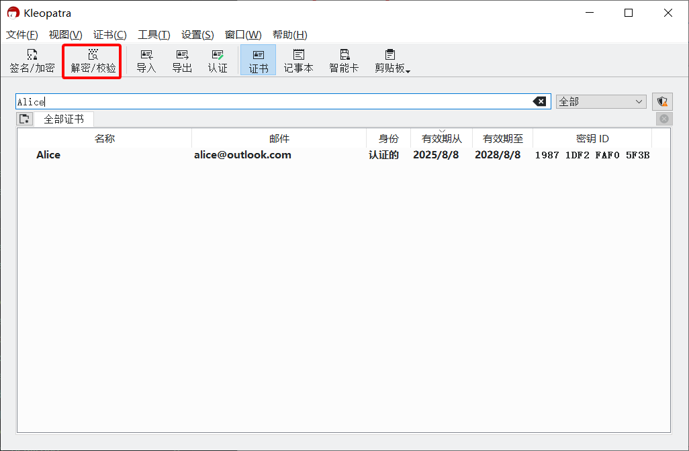
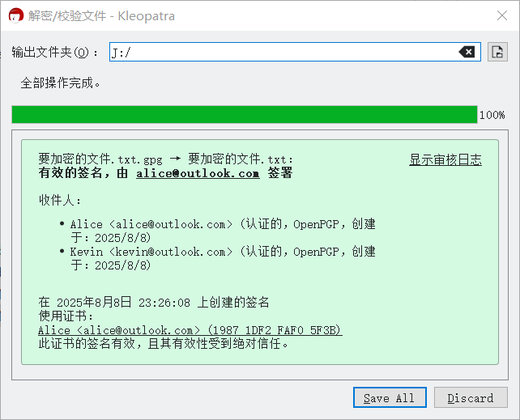
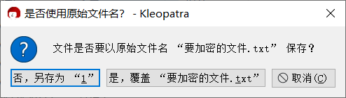

# 解密消息文件

1. 收到文件后缀名为 `.gpg` 或 `.pgp` 的密文文件。

2. 在资源管理器中双击密文文件。

    若双击后未出现 Kleopatra 的界面，则右击密文文件，然后点击“Decrypt and verify”（如果找不到该菜单，请检查 [GpgEX](prepare-software.md#gpgex) 是否安装，或在“More GpgEX Options”菜单里查找）。

    或在 Kleopatra 中点击工具栏的“解密/校验”按钮，然后在弹出的对话框中选择密文文件。

    

3. 在“Passphrase”输入框中输入私钥密码，然后点击“OK”按钮。

    

4. 点击“输出文件夹”输入框右侧的  按钮打开“选择文件夹”对话框，选择解密得到的文件的保存位置。
    
    随后再点击“Save All”按钮。

    

5. 如果软件询问是否以原始文件名保存，根据显示的文件名自行比较决定。原始文件名通常更为完整且含义清晰。（注：该界面上的“是，覆盖”为误译，实际是“是，另存为”）

    

6. 解密得到的文件会被保存在此前指定的位置。