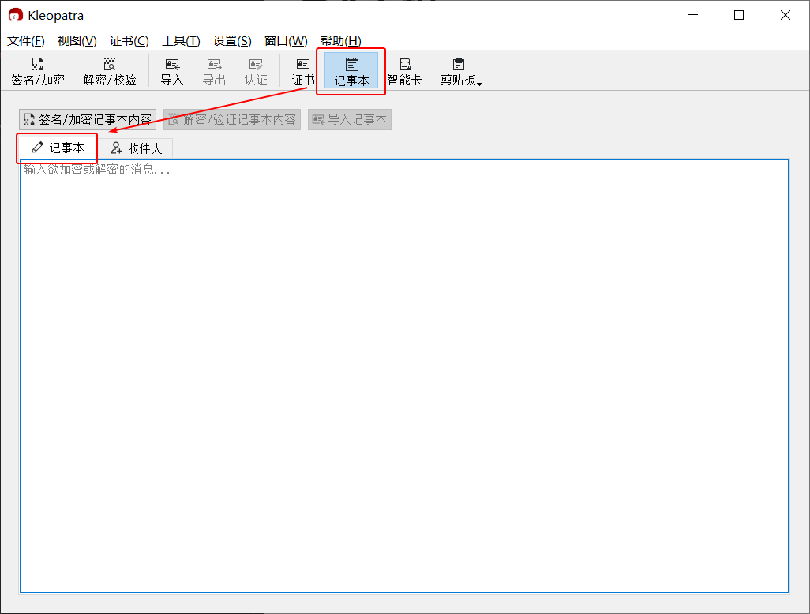
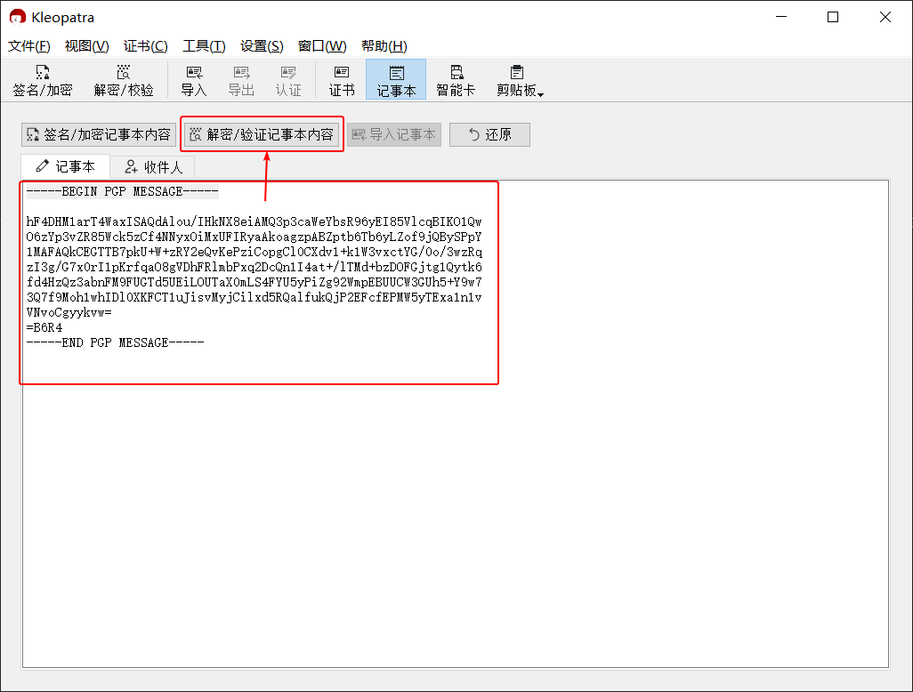
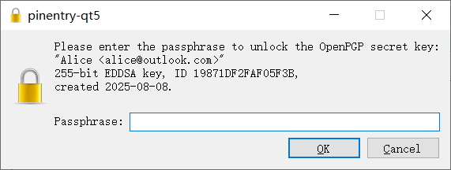

# 解密消息文本

1. 收到以 `-----BEGIN PGP MESSAGE-----` 开头的密文文本。

2. 进入 Kleopatra 的记事本界面，并切换到“记事本”选项卡。

    

3. 将密文文本粘贴到“记事本”选项卡下方的文本框中，然后点击“解密/验证记事本内容”按钮。

    

4. 在“Passphrase”输入框中输入先前设置的私钥密码，然后点击“OK”按钮。

    

5. 解密得到的文本会取代先前的密文文本出现在“记事本”选项卡下的输入框中。

    