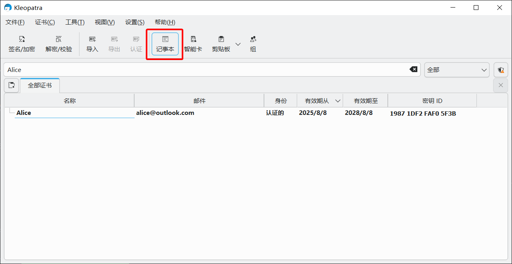
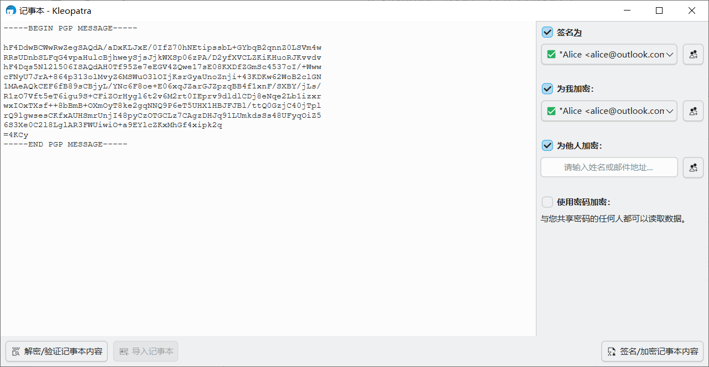
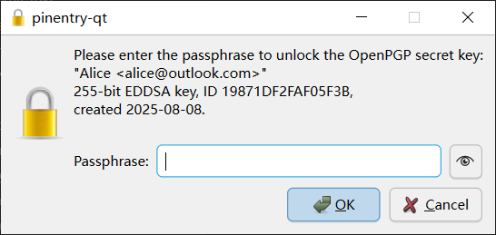
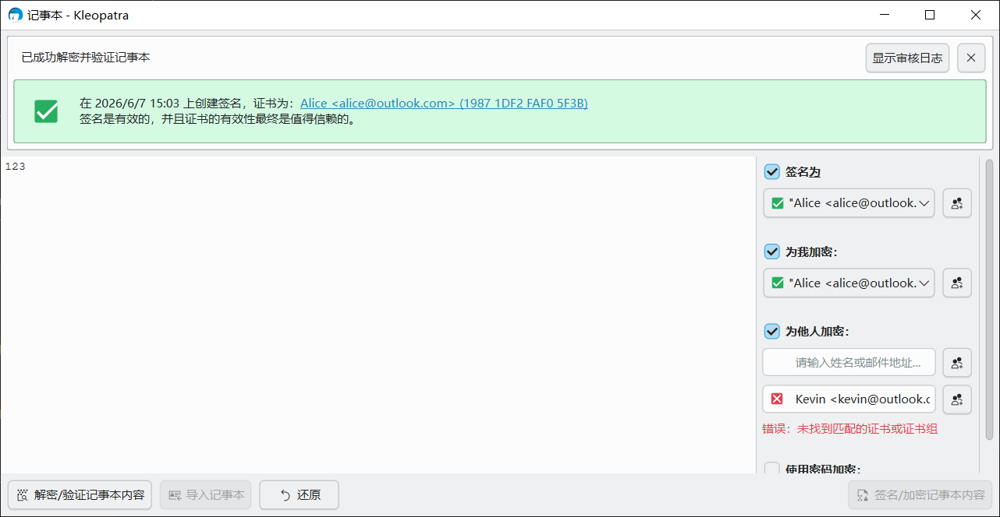

# 解密消息文本

1. 收到以 `-----BEGIN PGP MESSAGE-----` 开头的密文文本。

    > 可以通过文本首行的内容辨别公钥和密文：
    >
    > - 公钥文本首行的英文：BEGIN PGP **PUBLIC KEY BLOCK**  
    > - 密文文本首行的英文：BEGIN PGP **MESSAGE**
    >   

2. 在 Kleopatra 中，点击工具栏上的“记事本”按钮。

    

3. 把密文文本粘贴到弹出的记事本窗口中，然后点击左下角的“解密/验证记事本内容”按钮。

    

4. 在“Passphrase”输入框中输入私钥密码，然后点击“OK”按钮。

    

5. 解密得到的文本会取代先前的密文文本出现在左侧文本框中。

    