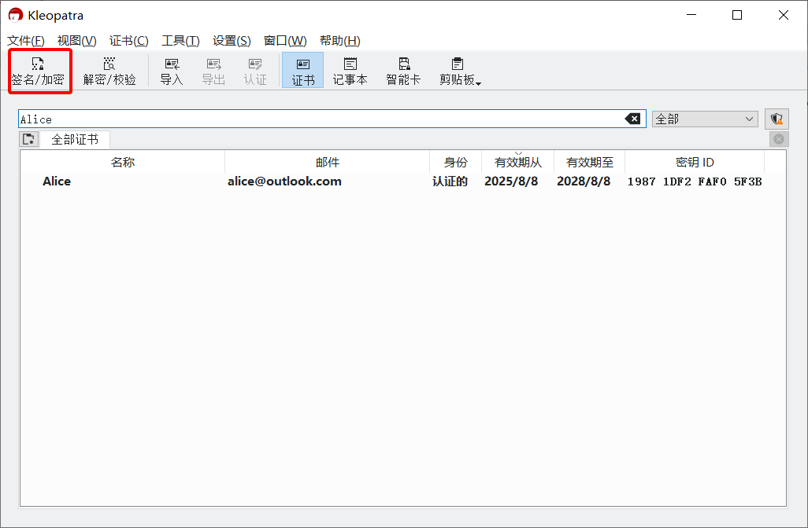
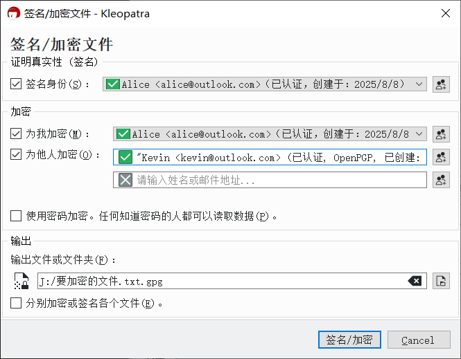

# 加密消息文件并发送

1. 确保已导入对方的公钥。

2. 在资源管理器中右击要发送的文件，然后点击“Sign and encrypt”（如果找不到该菜单，请检查 [GpgEX](prepare-software.md#gpgex) 是否安装）。

    或者在 Kleopatra 中，点击工具栏上的“签名/加密”按钮，然后在“选择一个或多个要签名/加密的文件”对话框中选择要发送的文件。

    

3. 在“签名/加密文件”对话框的“签名身份”下拉框中，选择自己的私钥，用于标识发件人的身份。

    

4. 点击"为他人加密"输入框右侧的  按钮，选择所有收件人（可多选）。所选收件人的公钥将用于加密。清空输入框可取消选择。

    > 如果输入框下方报错“错误：未找到匹配的证书或证书组”，则在确保对应收件人的公钥已导入后，清空输入框并重新选择收件人可修复报错。

5. 在“输出文件或文件夹”文本框中设置密文文件的保存位置以及文件名。

6. 点击“签名/加密”按钮。

7. 在“Passphrase”输入框中输入私钥密码，然后点击“OK”按钮。

    

8. 加密完成得到密文文件。

9. 发送密文文件给对方。