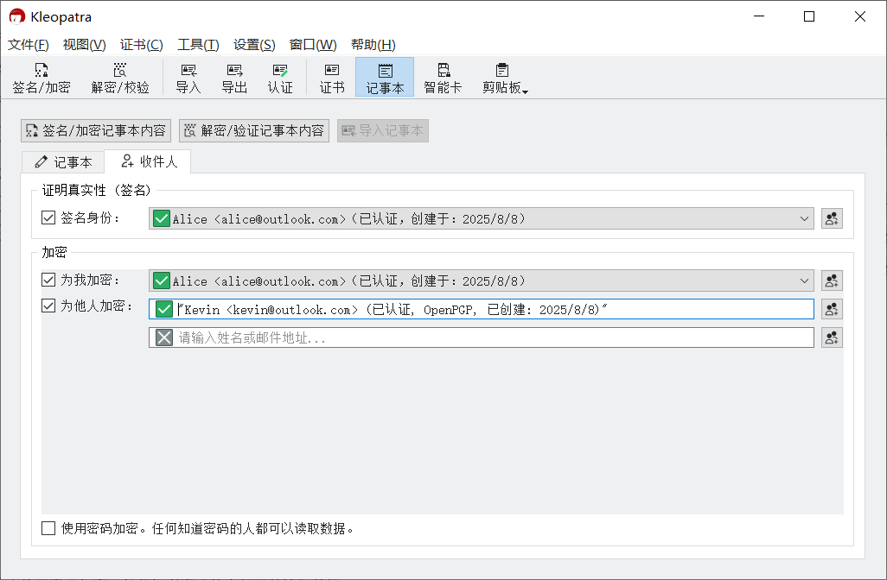
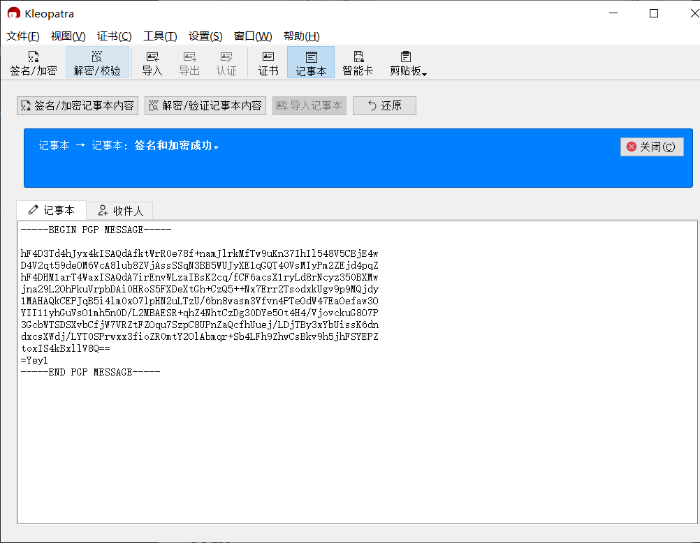

# 加密文本并发送

1. 完成对方公钥的导入。

2. 进入 Kleopatra 的记事本界面，并切换到“记事本”选项卡。

    

3. 在选项卡下方的文本框中输入要发送的文本。

4. 切换到“收件人”选项卡。

    

5. 在“签名身份”下拉框中选择自己的私钥，用于标识发件人的身份。

6. 点击"为他人加密"输入框右侧的  按钮，选择所有收件人，可以多选。选择的收件人的公钥将被用于加密消息。可以通过清空输入框内容来取消选择收件人。

7. 点击“签名/加密记事本内容”按钮。

8. 在“Passphrase”输入框中输入先前设置的私钥密码，然后点击“OK”按钮。

    

9. 加密得到的密文文本会取代原来要发送的文本出现在“记事本”选项卡下的输入框中。

    

10. 复制密文文本粘贴到 [文本分享网站](../pastebin.md) 上为其创建分享链接，然后把链接发送给对方。