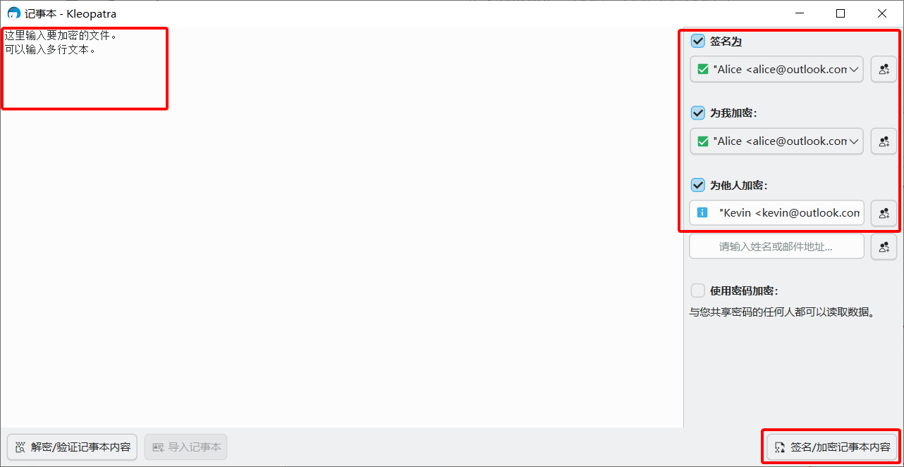
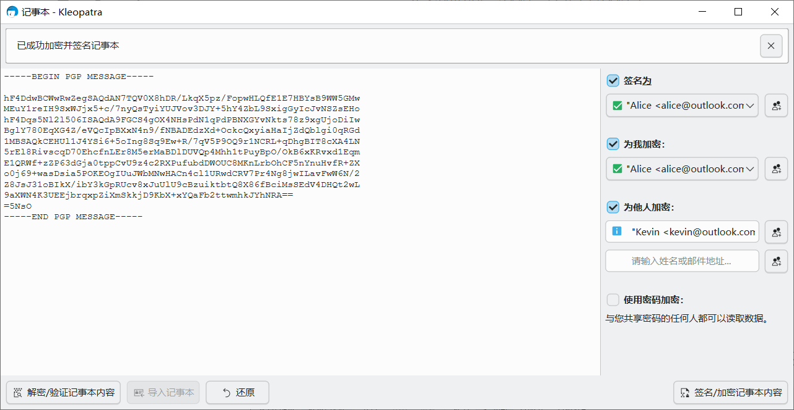

# 加密消息文本并发送

1. 确保已导入对方的公钥。

2. 在 Kleopatra 中，点击工具栏上的“记事本”按钮。

    

3. 在弹出的记事本窗口中输入要发送的文本。

    

4. 在右侧“签名为”下拉框中选择自己的私钥，用于标识发件人的身份。

5. 点击“为他人加密”输入框右侧的  按钮，选择所有收件人（可多选）。所选收件人的公钥将用于加密。清空输入框可取消选择。

    > 如果输入框下方报错“错误：未找到匹配的证书或证书组”，则在确保对应收件人的公钥已导入后，清空输入框并重新选择收件人可修复报错。

6. 点击右下角的“签名/加密记事本内容”按钮。

7. 在“Passphrase”输入框中输入私钥密码，然后点击“OK”按钮。

    

8. 加密完成后，密文文本会取代原文本显示在左侧文本框中。

    

9. 发送密文文本给对方。

    > 可复制密文文本到 [文本分享网站](../pastebin.md) 为其创建分享链接，再将链接发给对方。