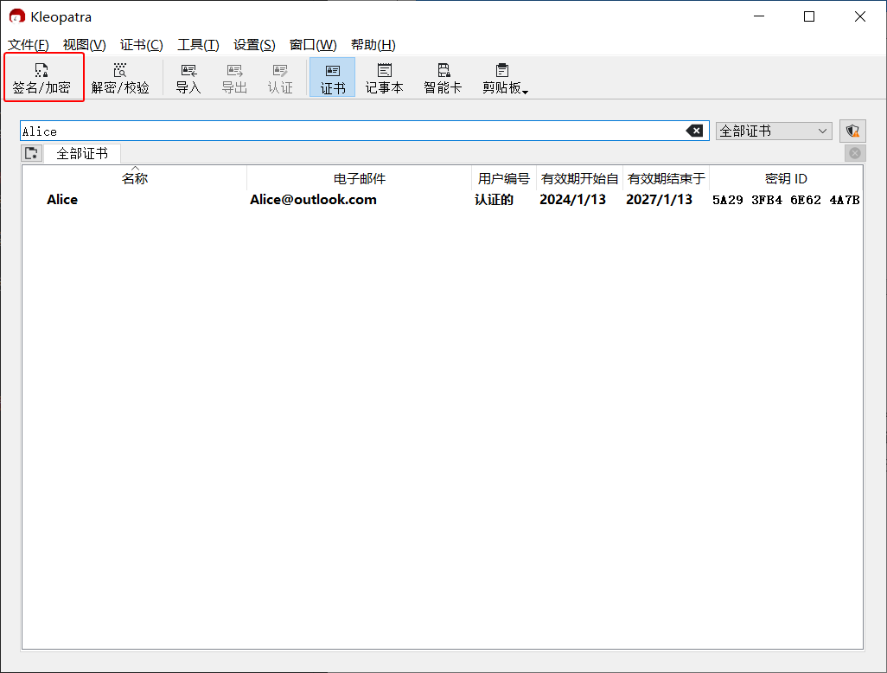
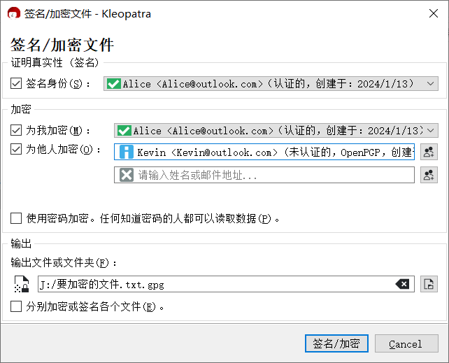

# 加密消息文件并发送

1. 完成对方公钥的导入。

2. 在文件管理器中右击要加密的文件，然后点击“Sign and encrypt”。

    或者在 Kleopatra 中，点击工具栏上的“签名/加密”按钮，然后在“选择一个或多个要签名/加密的文件”对话框中选择要加密的文件。

    

3. 在“签名/加密文件”对话框中，“签名身份”下拉框选择自己的私钥。选择的私钥用于将发件人的身份告知对方。

    

4. 点击"为他人加密"输入框右侧的  按钮选择对方的公钥（收件人），支持多选。选择的公钥用于加密消息，以及决定谁能解密。可以通过清空输入框内容来取消选择收件人。

5. “输出文件或文件夹”文本框中设置密文文件的保存位置以及文件名。

6. 点击“签名/加密”按钮。

7. 如果创建密钥对时设置了“使用密码句保护生成的密钥”，则此时需要在“Passphrase”输入框中输入先前设置的私钥密码，然后点击“OK”按钮。

    

8. 加密完成得到密文文件。

9. 将密文文件发送给对方。
