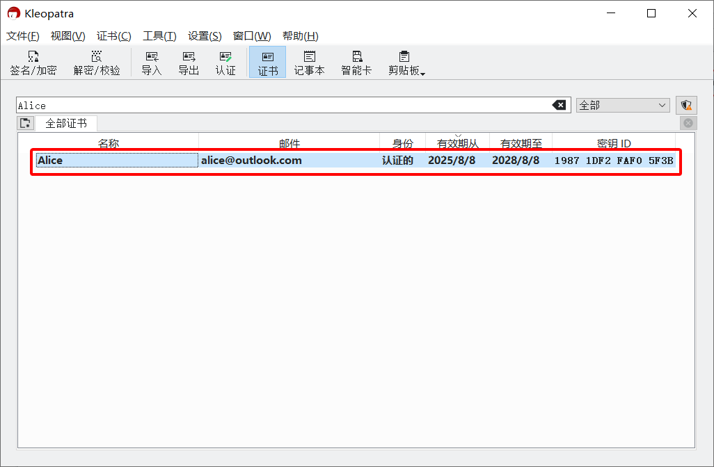
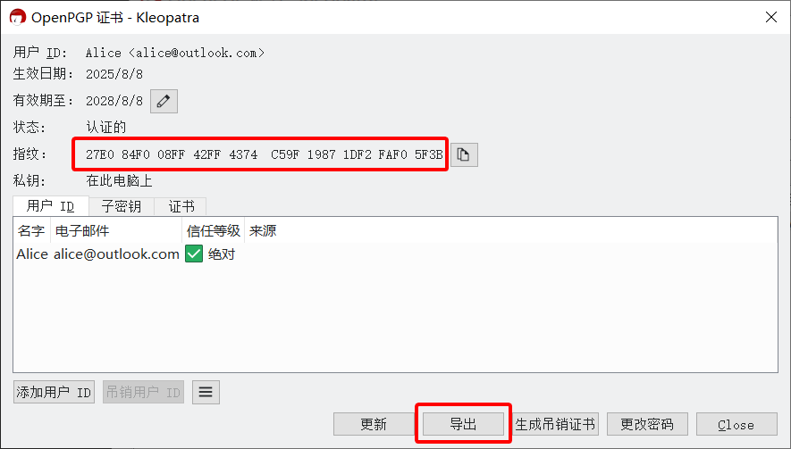
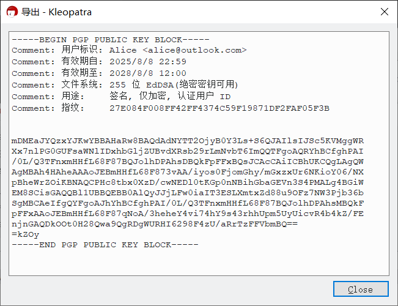

# 导出公钥文本

本节介绍 [导出公钥](#export-public-key) 和 [分享公钥](#share-public-key) 的方法。

## 导出公钥 {#export-public-key}

1. 进入 Kleopatra 的证书管理界面，**双击** 需要导出的公钥。

    

2. 进入证书细节界面，通过截图等方式记录指纹，用于后续的验证。

    > 每个公钥都有 **唯一对应** 的指纹，可用于验证公钥在发送过程中是否被篡改。

    

3. 点击“导出”按钮，公钥文本会显示在导出界面的文本框中。

    

## 分享公钥 {#share-public-key}

1. 发送公钥文本给对方。

    > 可以复制公钥文本到 [文本分享网站](../pastebin.md) 为其创建分享链接，再将链接发送给对方。

2. 等待对方发来 [导入的公钥的指纹](import-public-key-text.md#fingerprint)，并校验其与 [实际的公钥指纹](#fingerprint) 是否一致。

    - 如果一致，说明公钥发送成功，应告知对方校验结果。
    - 如果不一致，表明对方收到的公钥可能被篡改，应排查操作问题并重新发送公钥。若未发现问题，说明当前通信平台可能试图进行中间人攻击（MITM），应中止流程并停止使用该平台。