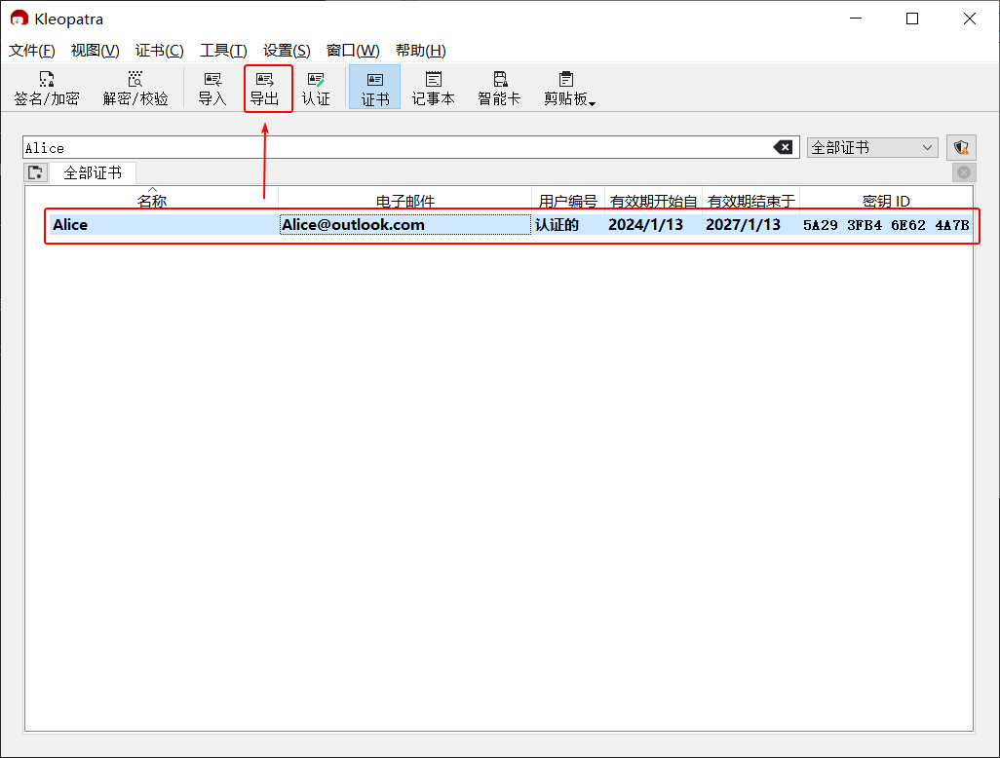

# 导出公钥

## 导出公钥文件并发送

1. 进入 Kleopatra 证书管理界面，**点击** 需要导出的公钥，然后点击工具栏上的“导出”按钮。

    

2. 选择存储公钥的位置，导出后缀名为 `.asc` 的公钥文件。

3. 将公钥文件发送给对方。

4. 回到 Kleopatra 证书管理界面，**双击** 需要导出的公钥。

5. 进入证书细节界面，将界面上的（公钥）指纹截图并发送给对方。

    