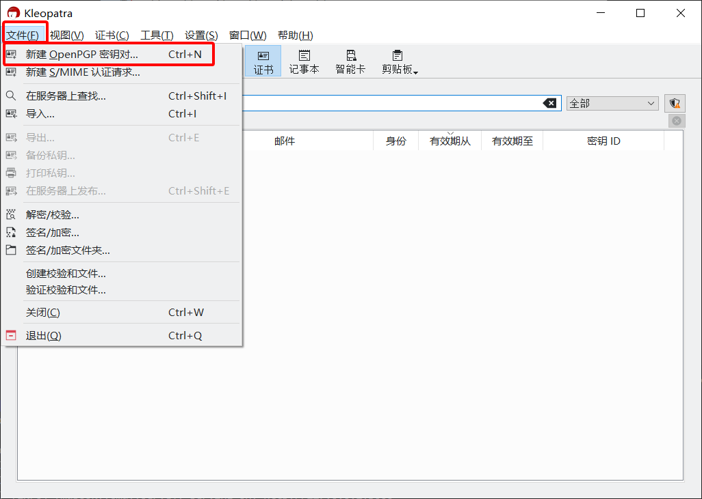
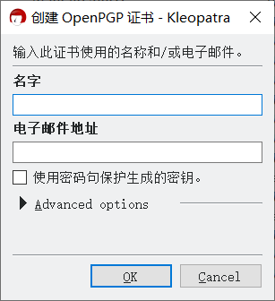
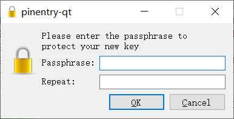

# 创建密钥对

1. 打开 Kleopatra。

2. 打开“文件”菜单，然后选择“创建 OpenPGP 密钥对”。

    

3. 输入你的名字和电子邮件地址（不一定要用真实姓名和实际存在的电子邮件地址），确保收到公钥的人能通过其辨认出密钥所有者的身份。

    > 如果该密钥对需要用于支持 OpenPGP 的在线服务，如电子邮箱、在线 Git 托管服务（如 GitHub）、公钥服务器等，则必须填写能够联系到你的电子邮件地址。  
    >   
    > 特殊的情况是如果 GitHub 账户启用了“Keep my email addresses private”（不公开我的电子邮件地址），则 Git 提交和 GPG 公钥需要使用 GitHub 提供的带有 `no-reply` 的电子邮件地址。详见 [这篇 GitHub 帮助文档第 8 条的 Note](https://docs.github.com/en/authentication/managing-commit-signature-verification/generating-a-new-gpg-key#generating-a-gpg-key "点击前往外部站点")。

    

4. 勾选“使用密码句保护生成的密钥”选项。

5. 点击“OK”按钮开始创建密钥对。

6. 为新创建的密钥对设置 **私钥密码**。在“Passphrase”和“Repeat”输入框中输入同一密码，然后点击“OK”按钮。

    > **重要说明：**  
    > 此处设置的私钥密码仅用于保护私钥本身；在使用私钥（如解密消息）时，Kleopatra 会要求输入该密码来临时解密私钥。这样做的目的是提高安全性，即使私钥意外泄露，也会因为缺少私钥密码而无法使用。  
    > 因此私钥密码和私钥都很重要，只能自己持有，不能公开；且密码应有一定的复杂度，不应该和其他密码相同。

    

7. 创建好的密钥对会显示在 Kleopatra 的证书管理界面中。