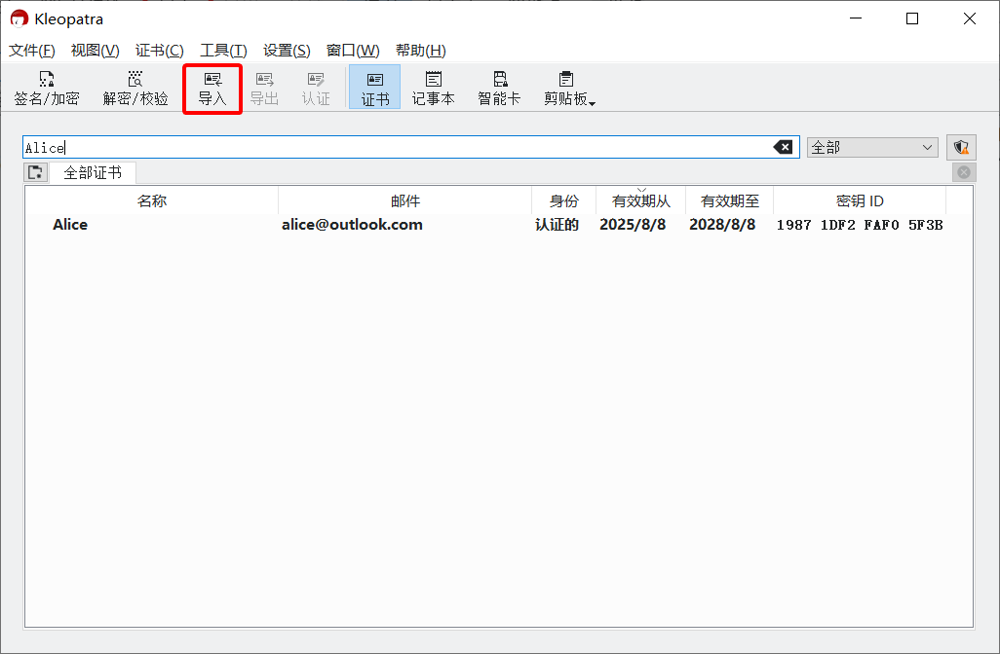
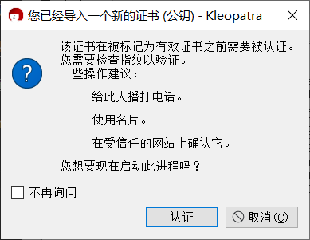
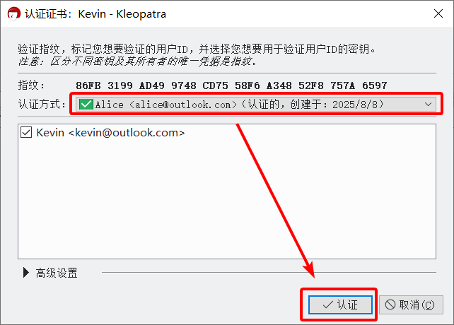

# 导入公钥文件

1. 收到文件后缀名为 `.asc` 的公钥文件。

2. 在资源管理器中双击打开公钥文件。

    或者在 Kleopatra 中点击工具栏上的“导入”按钮，然后在“选择证书文件”对话框中选择公钥文件。

    

3. 点击“认证”按钮。

    

4. 在认证证书界面上，将显示的指纹通过 **与传输公钥时不同的渠道** 发送给对方，并等待对方校验发送的指纹与预期公钥的指纹是否一致。

    - 如果一致，则进入下一步。
    - 如果不一致，表明收到的公钥可能被篡改，应排查操作问题并要求对方重新发送公钥。若未发现问题，说明当前通信平台可能试图进行中间人攻击（MITM），应中止流程并停止使用该平台。

    > 可以通过线下交流、电子邮件、网站公示或游戏聊天等渠道发送指纹。若充分信任当前通信平台，也可通过 [文本分享网站](../pastebin.md) 或 [一次性匿名聊天室](../communication-platform.md) 传递指纹，并通过原平台发送链接。

    

5. 在“认证方式”下拉框中选择自己的私钥，然后点击“认证”按钮。

    > **提示：**  
    > Kleopatra 会缓存正确的私钥密码（以及对称密钥），并在短时间内保持私钥的解锁状态。这段时间内，使用私钥时不需要重复输入私钥密码。

    

6. 在“Passphrase”输入框中输入私钥密码，然后点击“OK”按钮。

    

7. 已导入的公钥会显示在 Kleopatra 的证书管理界面中。