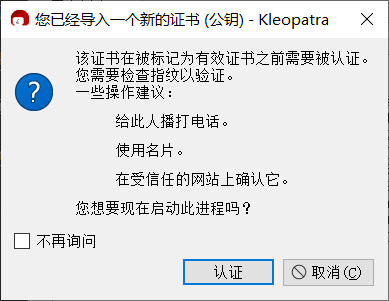

# 导入公钥

## 导入公钥文件

1. 收到文件后缀名为 `.asc` 的公钥文件，以及该公钥的指纹截图。

2. 在文件管理器双击打开公钥文件。

    或者在 Kleopatra 中点击工具栏上的“导入”按钮，然后在“选择证书文件”对话框中选择公钥文件。

    

3. 点击“认证”按钮。

    

4. 在认证证书界面上，对比显示的指纹是否与对方在截图中提供的指纹一致。

    - 如果一致，则进行下一步。
    - 如果不一致，表明收到的公钥不是对方想要发送的，应立即终止流程并要求对方重新发送公钥。如果情况依旧，说明当前通信平台存在安全风险，应考虑更换平台。

    

5. “认证方式”下拉框选择自己的私钥，然后点击“认证”按钮。

    

6. 如果创建密钥对时设置了“使用密码句保护生成的密钥”，则此时需要在“Passphrase”输入框中输入先前设置的私钥密码，然后点击“OK”按钮。

    

7. 完成公钥的导入与认证。