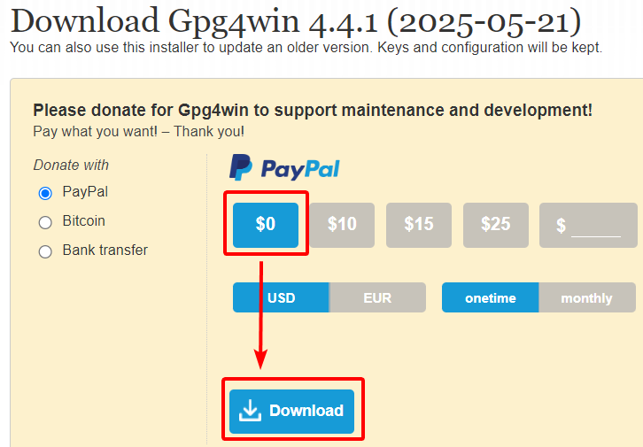
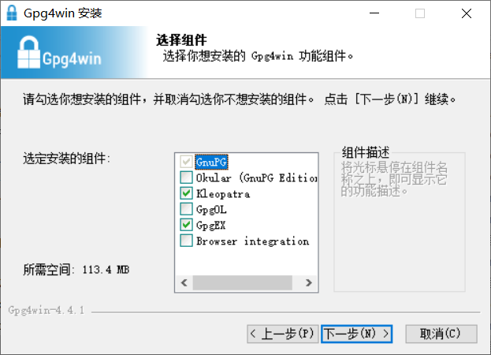

# 准备软件

## Windows

1. 浏览器打开 [Gpg4win 下载页面](https://www.gpg4win.org/get-gpg4win.html)。

2. 选择捐赠金额后下载安装包。若不捐赠，选择“$0”，再点击 “Download” 按钮直接下载。

    

3. 以管理员权限运行安装包。

4. 点击“下一步”按钮，进入选择组件界面。

    

5. 勾选加密软件 **Kleopatra**，再按需勾选其他要安装的组件：

    - **GpgEX**：在资源管理器的右键菜单中提供加解密等功能的快捷入口，**推荐安装**。
    - **GpgOL**：电子邮件客户端 Outlook 的插件，为其增加 OpenPGP 支持。
    - **Okular**：PDF 阅读器，支持 PDF 签名与签名校验。

6. 点击“下一步”按钮，按照界面提示完成后续步骤，直至完成软件安装。

## 其他平台 (Linux, BSD 等)

请优先使用发行版所提供的包管理器进行安装。