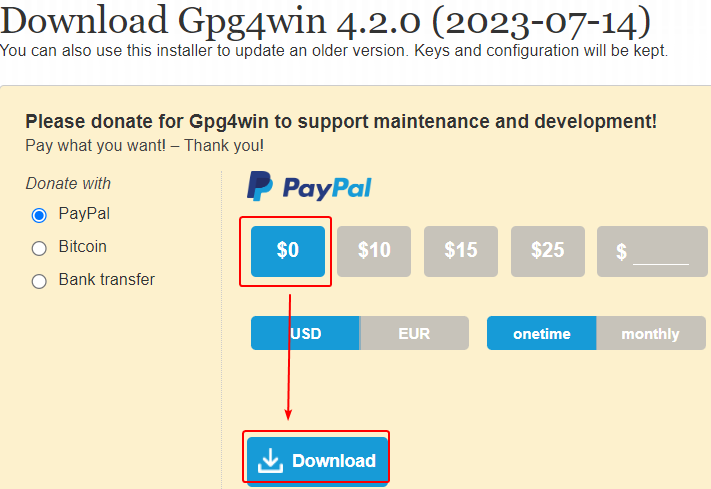
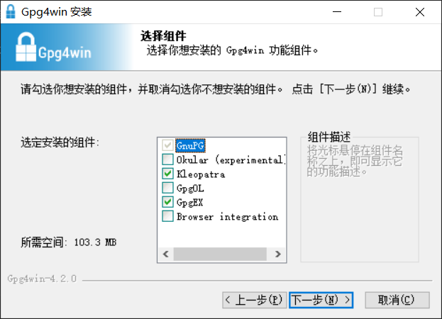

# 准备软件

## Windows

1. 浏览器打开 [Gpg4win 下载页面](https://www.gpg4win.org/get-gpg4win.html "点击前往外部站点")。

2. 选择捐赠的金额，然后点击下载按钮下载软件。

    如果不打算捐赠，点击“$0”，然后点击“Download”按钮直接下载软件安装包。

    

3. 以管理员权限运行下载好的安装包。

4. 点击“下一步”按钮，进入选择组件界面。

    

5. 根据你的需求勾选安装的组件：

    - **Kleopatra**：图形界面加密软件。后续教程将围绕该软件展开，**应当安装**。
    - **GpgEX**：在资源管理器中右键菜单添加加解密等功能的快捷入口，**推荐安装**。
    - **GpgOL**：电子邮件客户端 Outlook 的插件，用于为 Outlook 添加 OpenPGP 支持。
    - **Okular**：PDF 文档阅读器。支持使用 GPG 签名 PDF 文档，或检查 PDF 文档在进行签名后是否被更改。

6. 点击“下一步”，按照界面提示完成后续步骤，直至完成软件安装。

## 其他平台 (Linux, BSD 等)

请优先使用发行版所提供的包管理器进行安装。