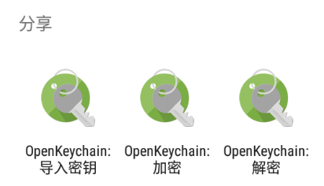

# 解密消息文本

1. 收到以 `-----BEGIN PGP MESSAGE-----` 开头的密文文本。

    > 可以通过文本首行的内容辨别公钥和密文：
    >
    > - 公钥文本首行的英文：BEGIN PGP **PUBLIC KEY BLOCK**  
    > - 密文文本首行的英文：BEGIN PGP **MESSAGE**
    >   

2. 选择以下一种方式让 OpenKeychain 读取密文文本。

    > **方式 1：分享密文文本到 OpenKeychain**
    >
    > 部分应用（如 Via 浏览器）支持分享文本到其他应用。利用此特性，分享密文文本到 OpenKeychain 进行解密。  
    >
    > 参考步骤： 
    >
    > 1. 选中密文文本。
    > 2. 点击文本周围出现的工具栏上的分享按钮。
    > 3. 选择“OpenKeychain：解密”选项和“**仅此一次**”选项（如果有该项）。
    >
    >    

    > **方式 2：手动指定从剪贴板读取**
    >
    > 1. 打开 OpenKeychain，从屏幕左侧向右滑动拉出侧边菜单。
    > 2. 选择“加密/解密”选项。
    >
    >    
    >
    > 3. 选择“从剪贴板导入”选项。

3. 在“密码”输入框中输入私钥密码，然后点击“解锁”按钮。

    

4. 解密得到的文本会显示在新页面。