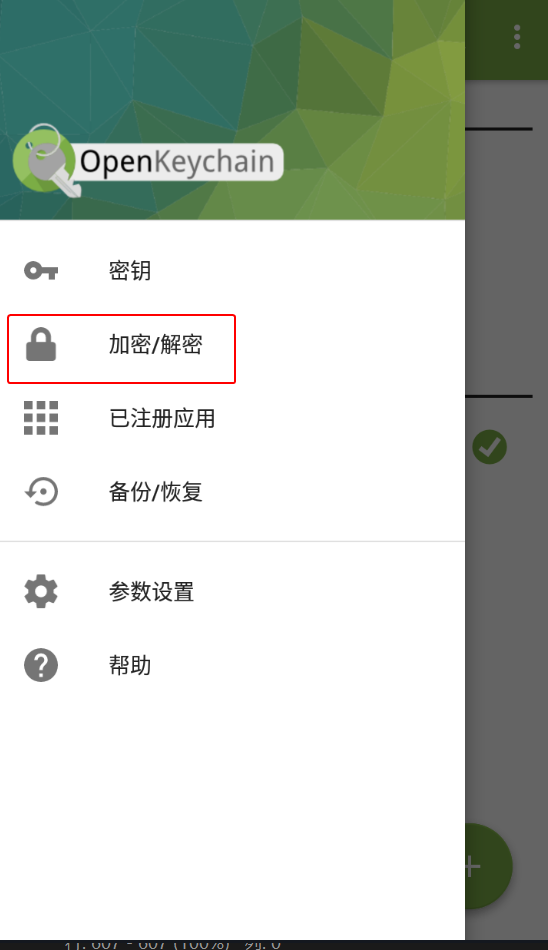

# 解密消息

## 解密密文文件

1. 收到文件后缀名为 `.gpg` 或 `.pgp` 的密文文件。

2. 选择以下一种方法让 OpenKeychain 读取密文文件。

    > **方式 1：分享密文文件到 OpenKeychain**
    >
    > 1. 文件管理器中长按密文文件。
    > 2. 点击分享相关的按钮，然后点击“OpenKeychain：解密”和“**仅此一次**”（如果有该项）。
    >
    >    

    > **方式 2：手动指定读取的文件**
    >
    > 1. 打开 OpenKeychain，从屏幕左侧向右滑动拉出侧边菜单。
    > 2. 点击“加密/解密”。
    >
    >    
    >
    > 3. 点击“从文件导入”。
    > 4. 选择需要解密的密文文件。

3. 进行解密操作时，如果创建密钥对时设置了私钥密码，则此时需要在“密码”输入框中输入先前设置的密码，然后点击“解锁”按钮。

    

4. 解密完成后会跳转到独立的页面显示解密得到的原始文件。可以另存到指定位置。