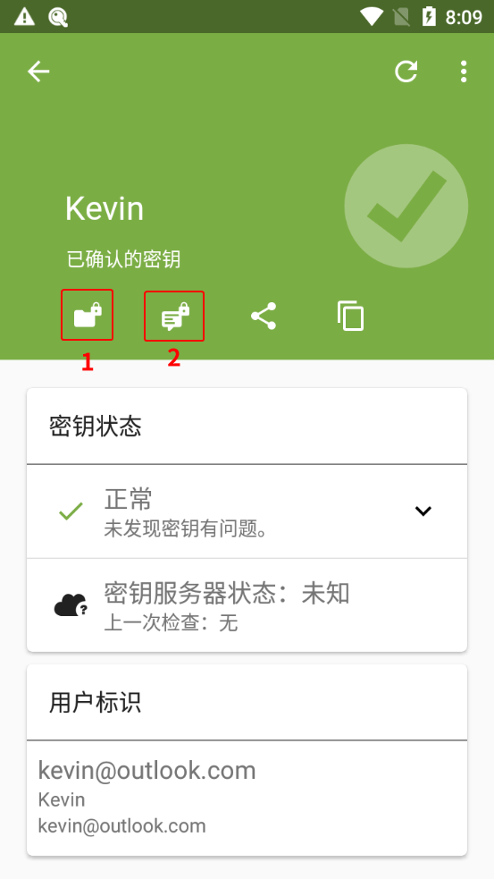
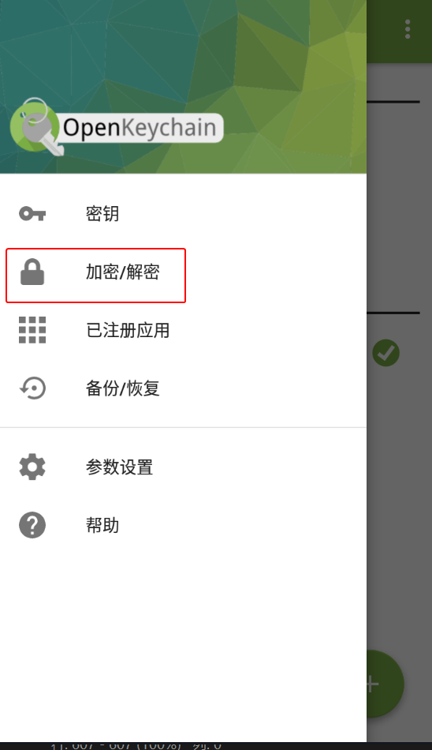
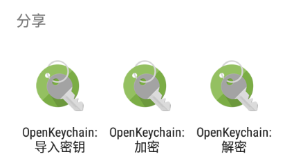
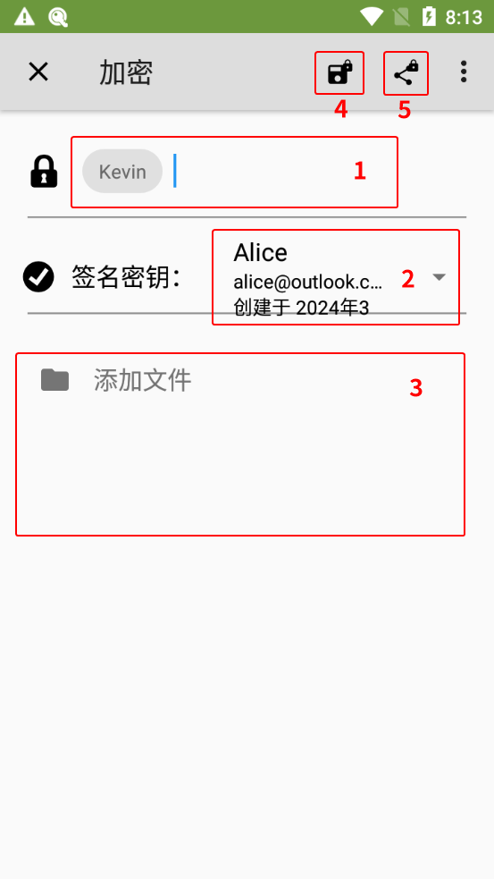

# 加密消息文件并发送

1. 确保已导入对方的公钥。

2. 选择以下一种方式进入 OpenKeychain 的加密文件界面。

    > **方式 1：从密钥概览界面进入**
    >
    > 1. 进入 OpenKeychain 的密钥管理界面，选择收件人的密钥。
    > 2. 点击加密文件按钮（图中的 1 处）。
    >
    >    

    > **方式 2：从加密/解密界面进入**
    >
    > 1. 打开 OpenKeychain，从屏幕左侧向右滑动拉出侧边菜单。
    > 2. 选择“加密/解密”选项。
    >
    >    
    >
    > 3. 选择“加密文件”选项。

    > **方式 3：分享要发送的文件到 OpenKeychain**
    >
    > 1. 在文件管理器（或要发送的文件所在的应用）中对文件选择“分享”相关的操作。
    > 2. 选择“OpenKeychain：加密”选项和“**仅此一次**”选项（如果有该项）。
    >
    >    

3. 进入加密文件界面。

    

4. 在图中“1”处的输入框中键入收件人的名字或电子邮件地址来选择所有收件人（可多选）。所选收件人的公钥将用于加密。

5. 在图中“2”处的下拉框中选择自己的私钥，用于标识发件人的身份。

6. 在图中“3”处的列表中选择要发送的文件。建议只选择一个文件，选择多个可能会加密失败。如需分享多个文件，可以手动将多个文件打包为一个文件再加密。

7. 点击图中“4”处或“5”处的按钮。“4”处的按钮可加密文件为密文文件并保存，“5”处的按钮可加密文件为密文文件并分享到其他应用。

8. 在“密码”输入框中输入私钥密码，然后点击“解锁”按钮。

    

9. 密文文件会根据此前所选操作，保存至指定位置或分享至其他应用。