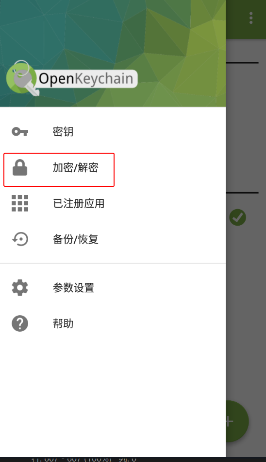
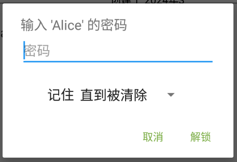

# 加密消息文本并发送

1. 确保已导入对方的公钥。

2. 选择以下一种方式进入 OpenKeychain 的加密文本界面。

    > **方式 1：从密钥概览界面进入**
    >
    > 1. 进入 OpenKeychain 的密钥管理界面，选择收件人的密钥。
    > 2. 点击加密文本按钮（图中的 2 处）。
    >
    >    

    > **方式 2：从加密/解密界面进入**
    >
    > 1. 打开 OpenKeychain，从屏幕左侧向右滑动拉出侧边菜单。
    > 2. 选择“加密/解密”选项。
    >
    >    
    >
    > 3. 选择“加密文本”选项。

    > **方式 3：分享要发送的文本到 OpenKeychain**
    >
    > 部分应用（如 Via 浏览器）支持分享文本到其他应用。利用此特性，分享要发送的文本到 OpenKeychain 进行加密。  
    >
    > 参考步骤： 
    >
    > 1. 选中全部要发送的文本。
    > 2. 点击文本周围出现的工具栏上的分享按钮。
    > 3. 选择“OpenKeychain：加密”选项和“**仅此一次**”选项（如果有该项）。
    >
    >    

3. 进入加密文本界面。

    

4. 在图中“1”处的输入框中键入收件人的名字或电子邮件地址来选择所有收件人（可多选）。所选收件人的公钥将用于加密。

5. 在图中“2”处的下拉框中选择自己的私钥，用于标识发件人的身份。

6. 在图中“3”处的输入框中输入要发送的文本。

7. 点击图中“4”处的按钮可加密文本并复制密文到剪贴板。

8. 在“密码”输入框中输入私钥密码，然后点击“解锁”按钮。

    

9. 加密完成后，密文文本会被复制到剪贴板，然后将剪贴板的密文文本发送给对方。

    > 可粘贴密文文本到 [文本分享网站](../pastebin.md) 为其创建分享链接，再将链接发送给对方。