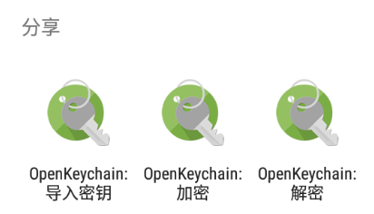

# 加密消息文件并发送

1. 完成对方公钥的导入。

2. 选择以下一种方式进入 OpenKeychain 的文本文件界面。

    > **方式 1：从密钥概览界面进入**
    >
    > 1. 进入 OpenKeychain 密钥管理界面，选择作为收件人的密钥。
    > 2. 点击加密文件按钮（图中的 1 处）。
    >
    >    

    > **方式 2：从加密/解密界面进入**
    >
    > 1. 打开 OpenKeychain，从屏幕左侧向右滑动拉出侧边菜单。
    > 2. 选择“加密/解密”选项。
    >
    >    
    >
    > 3. 选择“加密文件”选项。

    > **方式 3：分享要加密的文件到 OpenKeychain**
    >
    > 1. 在文件管理器或要加密的文件所在的应用中选择“分享”相关的选项。
    > 2. 选择“OpenKeychain：加密”选项和“**仅此一次**”选项（如果有该项）。
    >
    >    

3. 进入加密文件界面。

    

4. 在图中的 1 处输入公钥名称或邮箱地址来选择对方的公钥，支持多选。选择的公钥用于加密消息，以及决定谁能解密。

5. 在图中的 2 处选择自己的私钥，用于标识发件人的身份。

6. 在图中的 3 处选择要发送给对方的文件。只能选择一个文件，选择多个可能会加密失败。如需分享多个文件，可以手动将多个文件打包为一个文件再加密。

7. 点击图中的 4 处的按钮加密文件为密文文件并保存，或点击图中的 5 处加密文件为密文文件并分享到其他应用。

8. 进行加密操作时，在“密码”输入框中输入先前设置的私钥密码，然后点击“解锁”按钮。

    

9. 加密完成后密文文件会根据先前选择的操作，保存到指定的位置，或分享到其他应用。