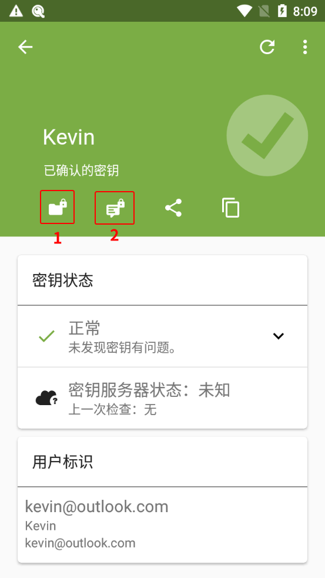
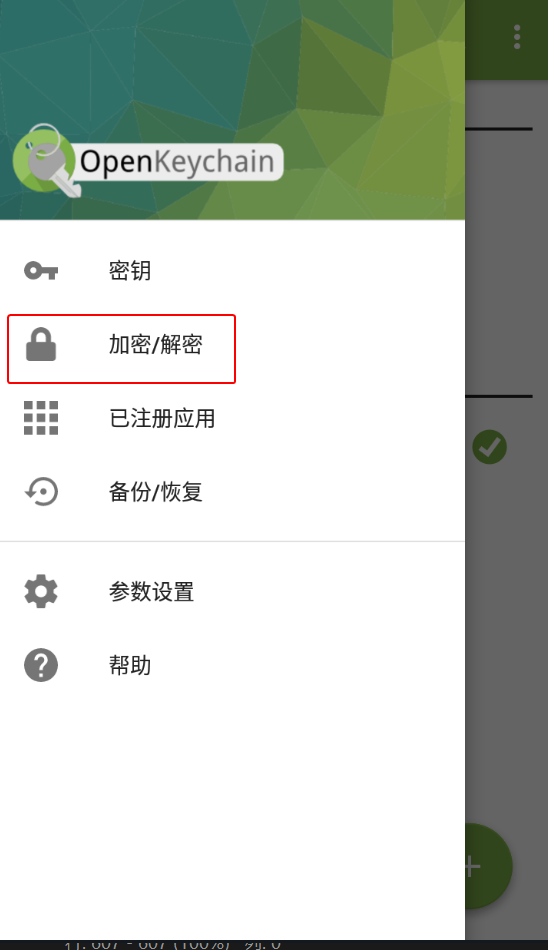
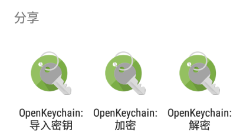
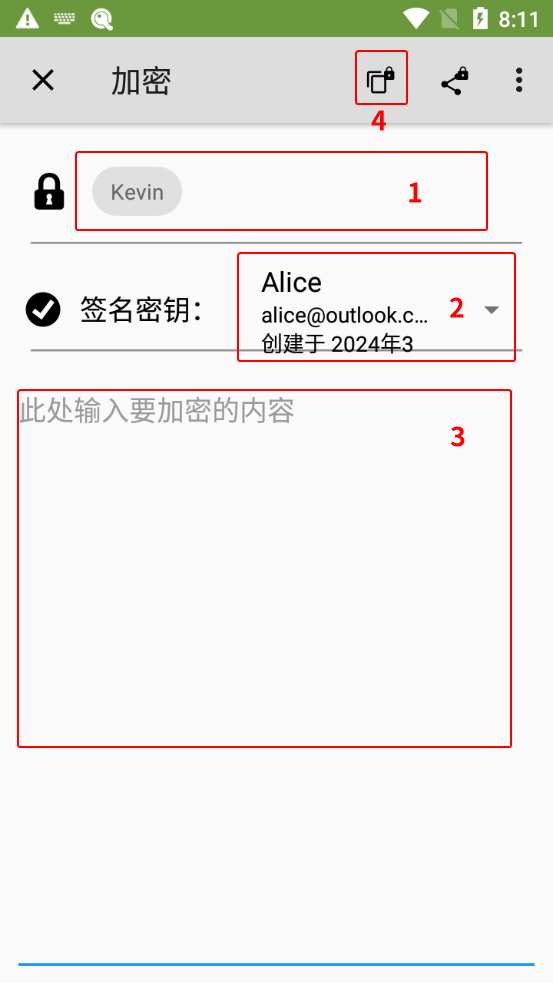
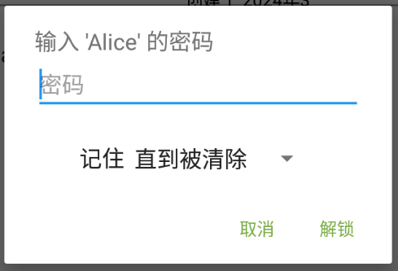

# 加密消息文本并发送

1. 完成对方公钥的导入。

2. 选择以下一种方法进入 OpenKeychain 的文本加密界面。

    > **方式 1：从密钥概览界面进入**
    >
    > 1. 进入 OpenKeychain 密钥管理界面，点击作为收件人的密钥。
    > 2. 点击加密文本按钮（红框 2 处）。
    >
    >    

    > **方式 2：从加密/解密界面进入**
    >
    > 1. 打开 OpenKeychain，从屏幕左侧向右滑动拉出侧边菜单。
    > 2. 点击“加密/解密”。
    >
    >    
    >
    > 3. 点击“加密文本”。

    > **方式 3：分享要加密的文本到 OpenKeychain**
    >
    > 部分应用（如 Via浏览器）支持分享文本到其他应用。利用此特性，分享要加密的消息到 OpenKeychain 让其读取。  
    > 
    > 参考步骤： 
    >
    > 1. 选中全部要加密的消息。
    > 2. 点击文本周围出现的工具栏上的分享按钮。
    > 3. 点击“OpenKeychain：加密”和“**仅此一次**”（如果有该项）。
    >
    >    

3. 以下为加密文本界面的说明：

    

    - 红框 1 处输入公钥名称或邮箱地址来选择对方的公钥，支持多选。选择的公钥用于加密消息，以及决定谁能解密。
    - 红框 2 处选择自己的私钥。选择的私钥用于将发件人的身份告知对方。
    - 红框 3 处输入要发送给对方的文本。
    - 红框 4 处为加密文本并复制密文到剪贴板。

4. 进行加密操作时，如果创建密钥对时设置了私钥密码，则此时需要在“密码”输入框中输入先前设置的密码，然后点击“解锁”按钮。

    

5. 加密完成后密文文本会被复制到剪贴板。将密文文本粘贴到 [文本分享网站](../pastebin.md) 上为其创建分享链接，然后把链接发送给对方。