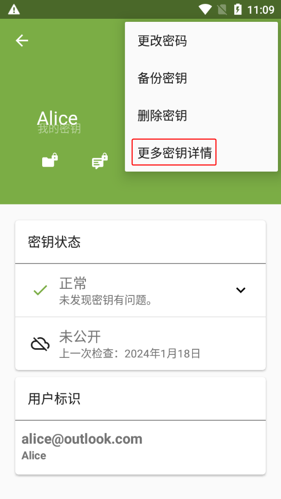

# 导出公钥文本

本节介绍 [导出公钥](#exporting-public-key) 和 [分享公钥](#sharing-public-key) 的方法。

## 导出公钥 {#exporting-public-key}

1. 进入 OpenKeychain 密钥管理界面，选择需要导出的公钥。

    

2. 进入密钥概览界面。点击右上角的三点按钮，然后选择“更多密钥详情”选项。

    

3. 进入密钥详情界面。切换到“分享”选项卡。

4. 通过截图等方式记录界面上的指纹，用于后续的验证。

    > 每个公钥都有对应且唯一的指纹，可用于验证公钥在发送过程中是否被篡改。

    

5. 点击下方“分享到...”右边的 **第二个图标**，复制公钥文本到剪贴板。

## 分享公钥 {#sharing-public-key}

1. 将剪贴板中的公钥文本粘贴到 [文本分享网站](../pastebin.md) 上为其生成分享链接，然后将链接发送给对方。

2. 等待对方 [导入公钥时通过另一信道发来指纹](importing-public-key-text.md#fingerprint)，并检查其与 [导出的公钥](#fingerprint) 的指纹是否一致。

    - 如果一致，说明公钥发送成功，应告知对方校验结果。
    - 如果不一致，表明对方收到的公钥可能被篡改，应排查操作问题并重新发送公钥。若未发现问题，说明当前通信平台可能试图进行中间人攻击（MITM），应中止流程并停止使用该平台。