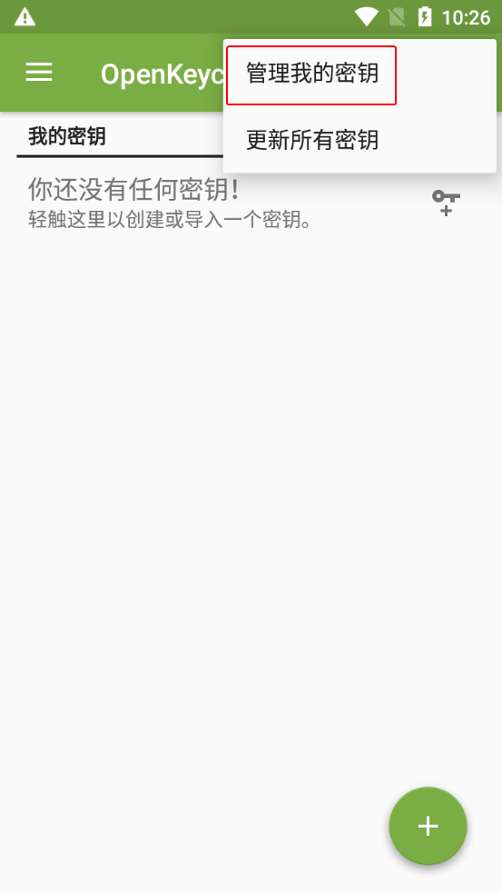
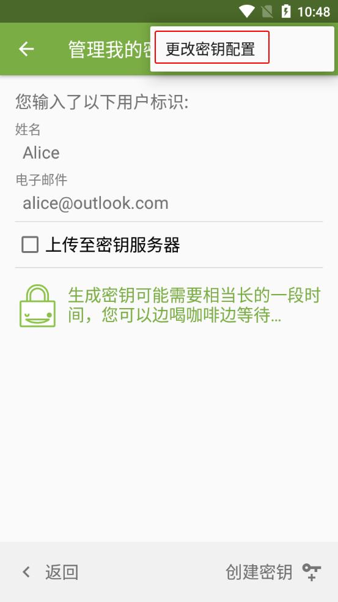
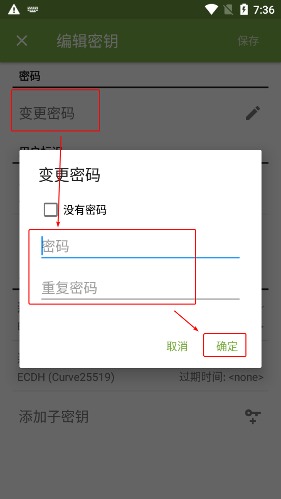
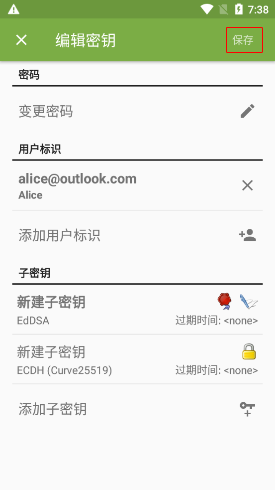

# 创建密钥对

> **注意：**  
> 如果你是第一次打开 OpenKeychain，请从 [第 2 步](#manage-my-keys) 开始看。

1. 在 OpenKeychain 的密钥管理界面，点击右上角的三点按钮，然后选择“管理我的密钥”选项。

    

2. 选择“创建密钥”选项。

    

3. 输入你的名字（不一定要用真实姓名），确保收到公钥的人能通过其辨认出密钥所有者的身份。

    

4. 输入你的电子邮件地址（不一定要用实际存在的电子邮件地址），确保收到公钥的人能通过其辨认出密钥所有者的身份。

    > 如果该密钥对需要用于支持 OpenPGP 的在线服务，如电子邮箱、在线 Git 托管服务（如 GitHub）、公钥服务器等，则必须填写能够联系到你的电子邮件地址。  
    >
    > 特殊的情况是 GitHub 如果启用了“Keep my email addresses private”（不公开我的电子邮件地址），则 Git 提交和 GPG 公钥需要使用 GitHub 提供的带有 `no-reply` 的电子邮件地址才能让该设置生效。详见 [这篇 GitHub 帮助文档第 8 条的 Note](https://docs.github.com/en/authentication/managing-commit-signature-verification/generating-a-new-gpg-key#generating-a-gpg-key "点击前往外部站点")。

    

5. 点击右上角的三点按钮，然后选择“更改密钥配置”选项。

    

6. 选择“变更密码”选项。

7. 为新创建的密钥对设置 **私钥密码**。在“密码”和“重复密码”输入框中输入相同的密码，然后点击“OK”按钮。

    > **重要说明：**  
    > 此处设置的私钥密码仅用于加密私钥本身；在使用私钥（如解密消息）时，OpenKeychain 会要求用户输入该密码来临时解密私钥。这样做的目的是提高安全性，即使私钥意外泄露，也会因为缺少私钥密码而无法使用。  
    > 因此私钥密码和私钥都很重要，只能自己持有，不能公开；且密码应有一定的复杂度，不应该和其他密码相同。

    

8. 点击右上角的“保存”按钮。

    

9. 点击右下角的“创建密钥”按钮。

    

10. 创建好的密钥对会显示在 OpenKeychain 的密钥管理界面中。

> 目前为止，你可能在 OpenKeychain 的界面中遇到了这三种相似而模糊的表达，以下是简单的辨析：
> 
> - 密钥对：由公钥与配对的私钥组成。
> - 证书：由密钥对或者单独的公钥，再加上额外的元数据（如作为身份信息的名字和电子邮件地址等）组成。
> - 密钥：通常代指证书；在对称加密中也可以指对称密钥（密码）。
> 
> 为了简单起见，在实际使用中，你可以结合上下文理解相应术语的含义，不需要过于纠结其精确定义。