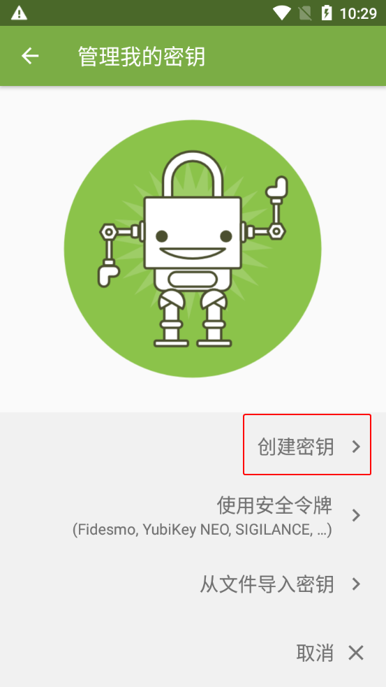
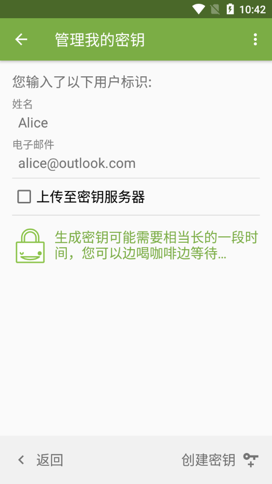

# 创建密钥对

> **注意：**  
> 如果你是第一次打开 OpenKeychain，请从 [第 2 步](#manage-my-keys) 开始看。

1. 在 OpenKeychain 的密钥管理界面，点击右上角的三点按钮，然后选择“管理我的密钥”选项。

    

2. 选择“创建密钥”选项。

    

3. 输入你的名字（不一定要用真实姓名），确保收到公钥的人能通过其辨认出密钥所有者的身份。

    

4. 输入你的邮箱地址（不一定要用实际存在的邮箱），确保收到公钥的人能通过其辨认出密钥所有者的身份。

    > 如果该密钥对需要用于支持 OpenPGP 的在线服务，如电子邮箱、在线 Git 托管服务（如 GitHub）、公钥服务器等，则必须填写能够联系到你的邮箱地址。  
    >   
    > 特殊的情况是 GitHub 如果启用了“Keep my email addresses private”（不公开我的邮箱地址），则 Git 提交和 GPG 公钥需要使用 GitHub 提供的带有 `no-reply` 的邮箱地址才能让该设置生效。详见 [这篇 GitHub 帮助文档第 8 条的 Note](https://docs.github.com/en/authentication/managing-commit-signature-verification/generating-a-new-gpg-key#generating-a-gpg-key)。

    

5. 点击右上角的三点按钮，然后选择“更改密钥配置”选项。

    

6. 选择“变更密码”选项。

7. 为新创建的密钥对设置私钥密码。在“密码”和“重复密码”输入框中输入同一密码，然后点击“OK”按钮。

    > **重要说明：**  
    > 此处是为私钥设置 **私钥密码**。在存储私钥前，OpenKeychain 会使用该密码将私钥加密；在私钥使用前（如解密消息等），OpenKeychain 会要求用户输入该密码来临时解密私钥。这样做的目的是提高安全性，即使私钥意外泄露，也会因为缺少私钥密码而无法使用。  
    > 因此私钥密码和私钥都很重要，只能自己持有，不能公开；且密码应有一定的复杂度，不应该和其他密码相同。

    

8. 点击右上角的“保存”按钮。

    

9. 点击右下角的“创建密钥”按钮。

    

10. 创建好的密钥对会显示在 OpenKeychain 的密钥管理界面中。