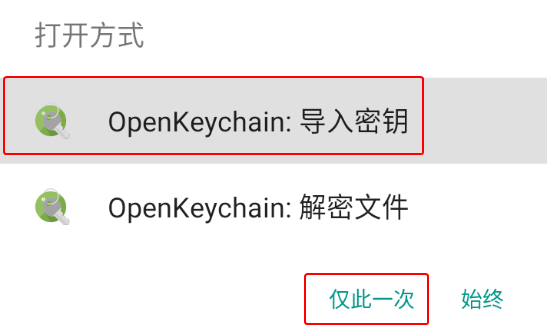
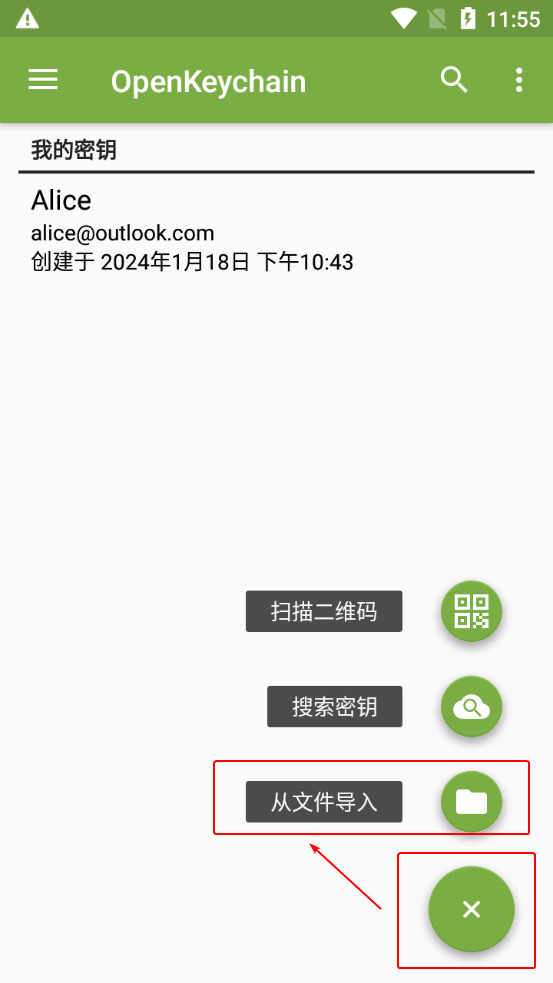
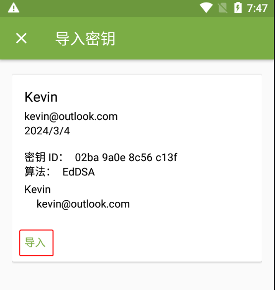
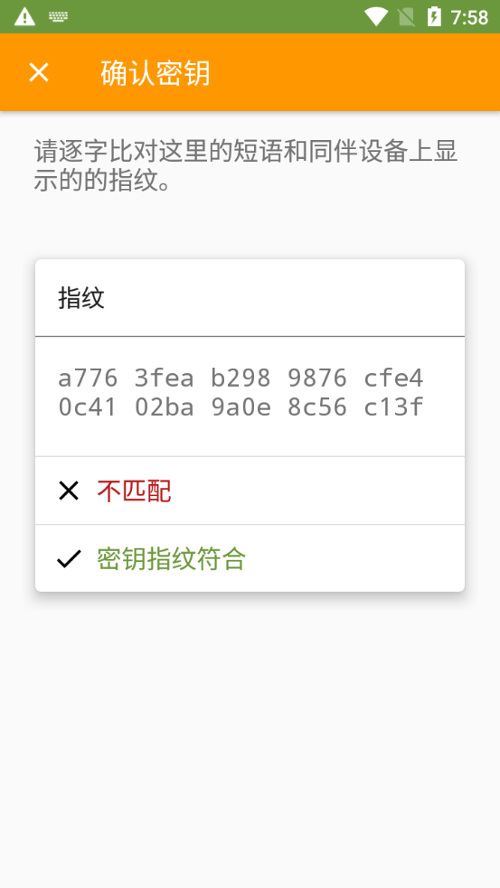
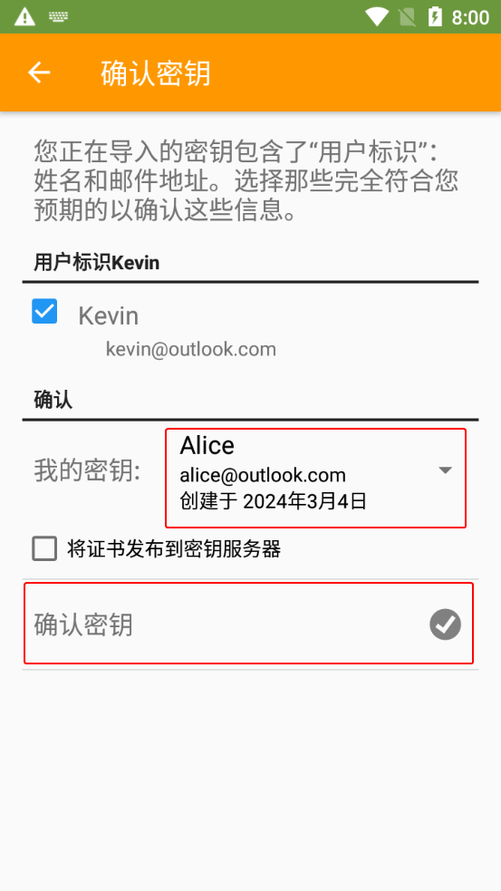

# 导入公钥文件

1. 收到文件后缀名为 `.asc` 的公钥文件。

2. 选择以下一种方式让 OpenKeychain 读取公钥文件。

    > **方式 1：直接打开公钥文件**
    >
    > 点击打开公钥文件，然后选择“OpenKeychain：导入密钥”选项和“**仅此一次**”选项（如果有该项）。
    >
    > 

    > **方式 2：手动指定并读取公钥文件**
    >
    > 1. 打开 OpenKeychain 进入密钥管理界面。
    > 2. 点击界面右下角的圆形“+”图标，然后选择“从文件导入”选项。
    >
    >    
    >
    > 3. 点击浏览公钥文件按钮，然后选择要导入的公钥文件。
    >
    >    

3. 点击“导入”按钮。

    

4. 回到密钥管理界面，选择刚导入的公钥。

    

5. 进入密钥概览界面。点击右上角的三点按钮，然后选择“通过指纹确认”选项。

    

6. 将界面上显示的指纹 **通过另一信道** 发送给对方，并等待对方校验发送的指纹与预期公钥的指纹是否一致。

    - 如果一致，则选择“密钥指纹符合”选项。
    - 如果不一致，表明收到的公钥可能被篡改，应排查操作问题并要求对方重新发送公钥。若未发现问题，说明当前通信平台可能试图进行中间人攻击（MITM），应中止流程并停止使用该平台。

    > 发送指纹时，可以选择线下交流、电子邮件、网站公示或游戏聊天等作为另一信道。若充分信任当前通信平台，也可通过同一平台发送 [文本分享网站](../pastebin.md) 或 [一次性匿名聊天室](../communication-platform.md) 的链接。

    

7. 在“我的密钥”下拉框中选择自己的私钥，然后点击“确认密钥”按钮。

    

8. 在“密码”输入框中输入先前设置的私钥密码，然后点击“解锁”按钮。

    

9. 已导入的公钥会显示在 OpenKeychain 的密钥管理界面中。