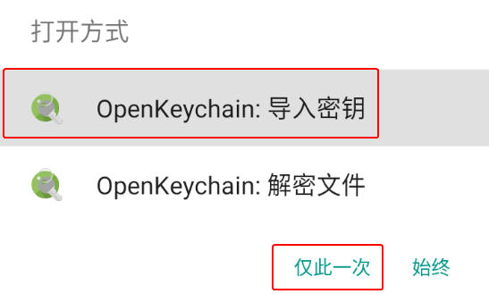
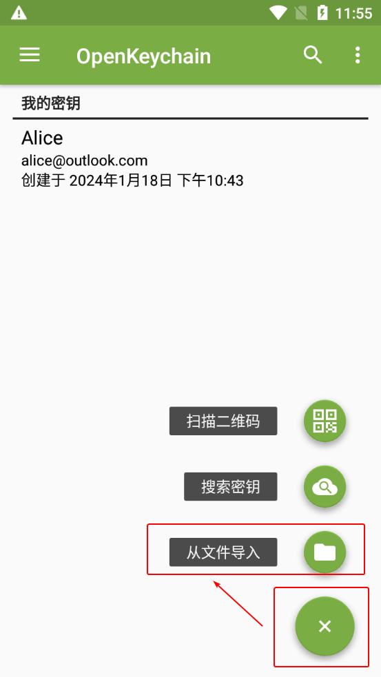
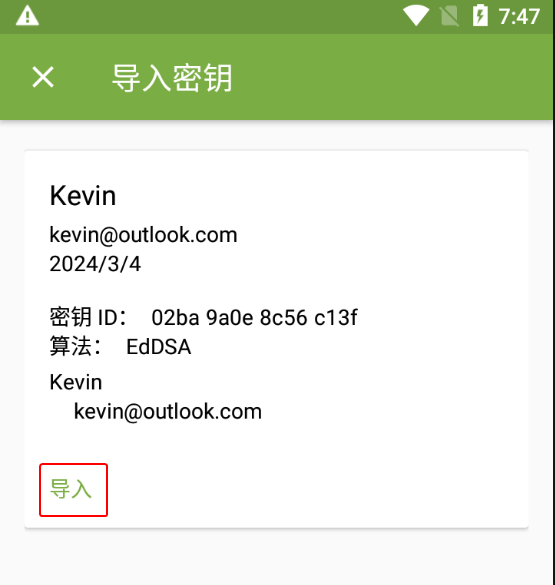
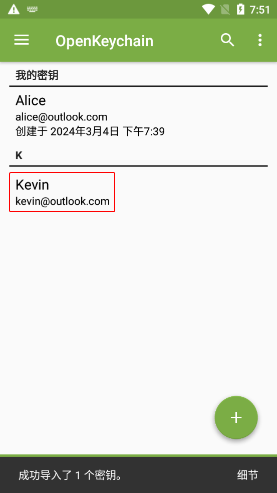
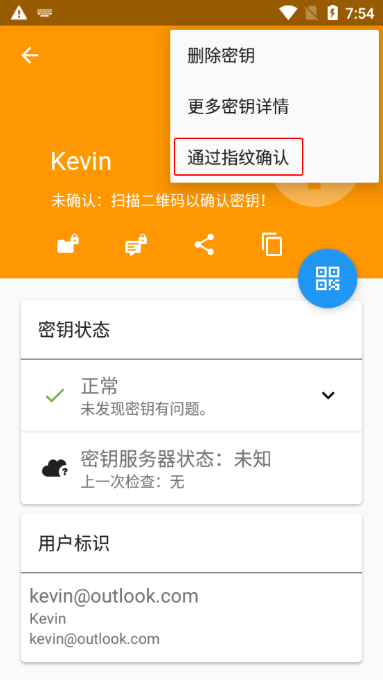
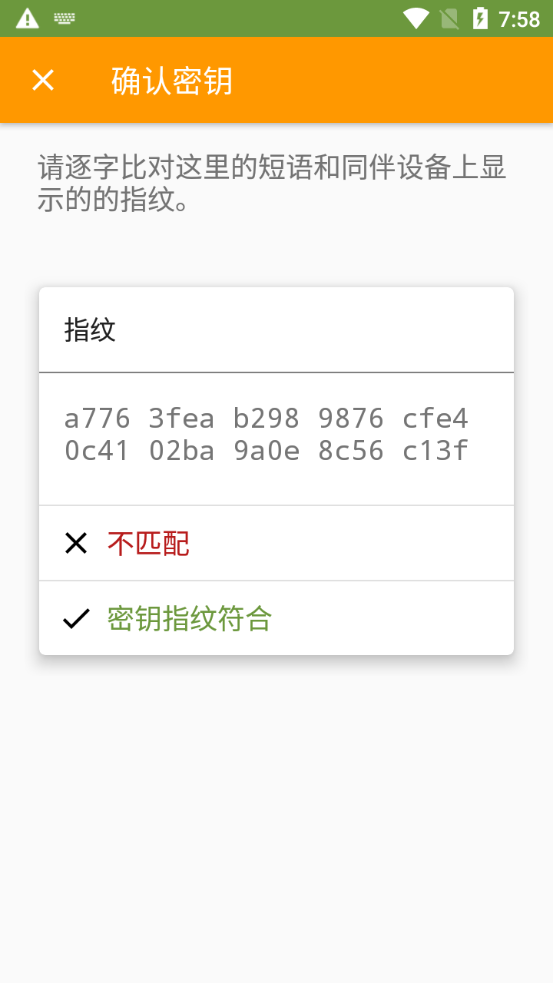
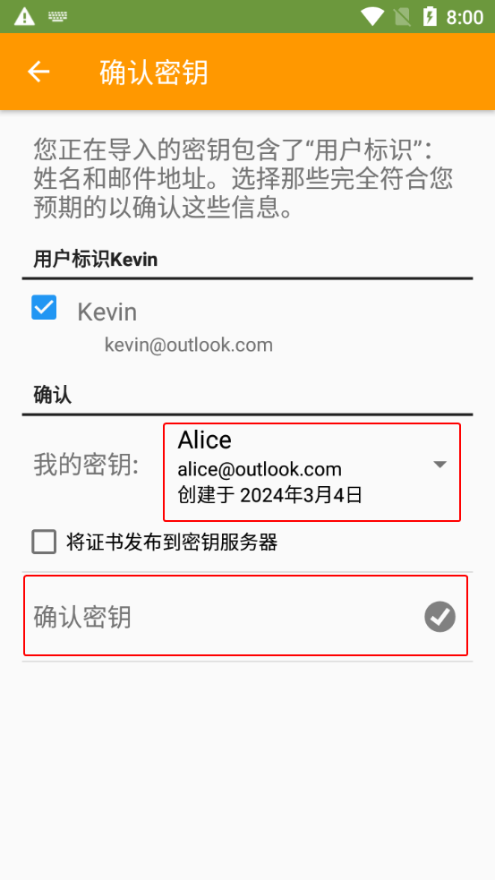

# 导入公钥文件

1. 收到文件后缀名为 `.asc` 的公钥文件，以及该公钥的指纹截图。

2. 选择以下一种方法让 OpenKeychain 读取公钥文件。

    > **方法 1：直接打开公钥文件**
    >
    > 文件管理器点击公钥文件，然后点击“OpenKeychain：导入密钥”和“**仅此一次**”（如果有该项）。
    >
    > 

    > **方式 2：手动指定并读取公钥文件**
    >
    > 1. 打开 OpenKeychain 进入密钥管理界面。
    > 2. 点击界面右下角的圆形“+”图标，然后点击“从文件导入”。
    >
    >    
    >
    > 3. 点击浏览公钥文件按钮，然后选择要导入的公钥文件。
    >
    >    

3. 点击“导入”按钮。

    

4. 回到密钥管理界面，点击刚导入的公钥。

    

5. 进入密钥概览界面。点击右上角的三点按钮，然后点击“通过指纹确认”。

    

6. 将界面上显示的指纹 **通过另一平台**（如 [文本分享网站](../pastebin.md)）发送给对方，并等待对方校验发送的指纹与预期公钥的指纹是否一致。

    - 如果一致，则点击“密钥指纹符合”。
    - 如果不一致，表明收到的公钥可能被篡改，应排查操作问题并要求对方重新发送公钥。若未发现问题，说明当前通信平台可能试图进行中间人攻击（MITM），应中止流程并停止使用该平台。

    

7. “我的密钥”下拉框选择自己的私钥，然后点击“确认密钥”按钮。

    

8. 如果创建密钥对时设置了私钥密码，则此时需要在“密码”输入框中输入先前设置的密码，然后点击“解锁”按钮。

    

9. 完成公钥的导入与认证。