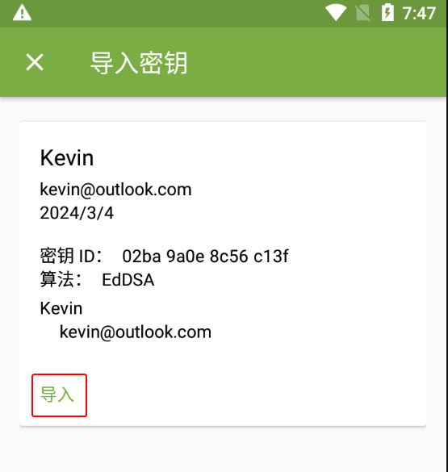
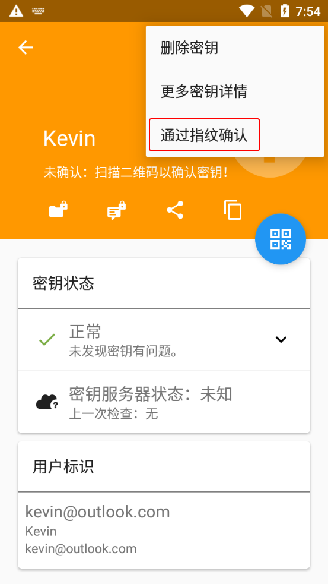
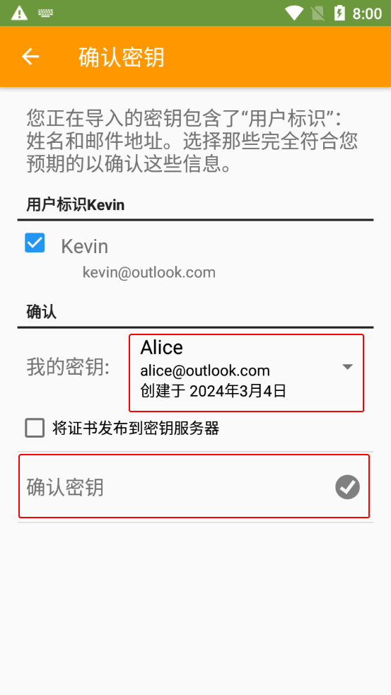

# 导入公钥文本

1. 收到以 `-----BEGIN PGP PUBLIC KEY BLOCK-----` 开头的公钥文本，以及该公钥的指纹截图。

2. 选择以下一种方法让 OpenKeychain 读取公钥文本。

    > **方法 1：分享公钥文本到 OpenKeychain**  
    >
    > 部分应用（如 Via浏览器）支持分享文本到其他应用。利用此特性，分享公钥文件到 OpenKeychain 让其读取。  
    > 
    > 参考步骤： 
    >
    > 1. 选中全部公钥文本。
    > 2. 点击文本周围出现的工具栏上的分享按钮。
    > 3. 点击“OpenKeychain：导入密钥”和“**仅此一次**”（如果有该项）。
    >
    >    

    > **方法 2：自动从剪贴板读取公钥文本**  
    >
    > 1. 复制公钥文本，然后打开 OpenKeychain 进入密钥管理界面。
    > 2. 界面下方出现“在剪贴板中发现密钥数据！”的提示，点击右侧的“查看”按钮。
    >
    >    

    > **方法 3：手动指定从剪贴板读取公钥文本**  
    >
    > 1. 复制公钥文本，然后打开 OpenKeychain 进入密钥管理界面。
    > 2. 点击界面右下角的圆形“+”图标，然后点击“从文件导入”。
    >
    >    
    >
    > 3. 进入导入密钥界面。点击右上角的三点图标，然后点击“从剪贴板读取”。
    >
    >    

2. 点击“导入”按钮。

    

3. 回到密钥管理界面，点击刚导入的公钥。

    

4. 进入密钥概览界面。点击右上角的三点按钮，然后点击“通过指纹确认”。

    

5. 将界面上显示的指纹 **通过另一平台**（如 [文本分享网站](../pastebin.md)）发送给对方，并等待对方校验发送的指纹与预期公钥的指纹是否一致。

    - 如果一致，则点击“密钥指纹符合”。
    - 如果不一致，表明收到的公钥可能被篡改，应排查操作问题并要求对方重新发送公钥。若未发现问题，说明当前通信平台可能试图进行中间人攻击（MITM），应中止流程并停止使用该平台。

    

6. “我的密钥”下拉框选择自己的私钥，然后点击“确认密钥”按钮。

    

7. 如果创建密钥对时设置了私钥密码，则此时需要在“密码”输入框中输入先前设置的密码，然后点击“解锁”按钮。

    

8. 完成公钥的导入与认证。