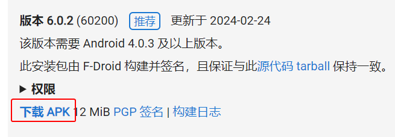

# 准备软件

1. 浏览器打开 [应用的 F-Droid 下载页面](https://f-droid.org/packages/org.sufficientlysecure.keychain/ "点击前往外部站点")。

2. 点击最新版本对应的“下载 APK”链接。

    

3. 安装 APK。如果安装失败，可以尝试以下解决方法：

    - 设置允许（应用）安装未知来源软件。
    - 退出操作系统的账号登录。
    - 关闭相关的安全选项。